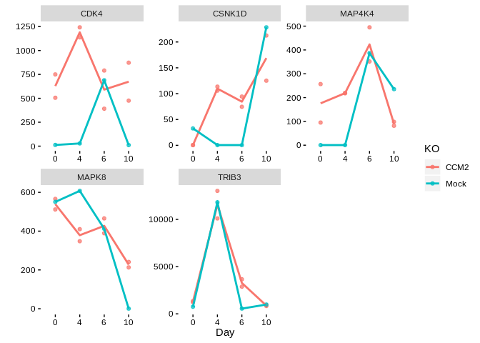

Time-lapse RNAseq H7 CCM Analysis
================
Matthew Berginski

Read In Data/Experimental Design
================================

``` r
#I wrote this csv file manually for the data set
H7_exp_data = read_csv(here('RNAseq_results/CCM2H7/sample_data.csv'))
```

    ## Warning: Missing column names filled in: 'X1' [1]

    ## Parsed with column specification:
    ## cols(
    ##   X1 = col_character(),
    ##   Cell_line = col_character(),
    ##   Day = col_double(),
    ##   KO = col_character()
    ## )

``` r
#convert the Day column to factor to make it clear that the day of sampling is
#an exp variable and not a quantitative value
H7_exp_data$Day <- as.factor(H7_exp_data$Day)
H7_exp_data$KO <- as.factor(H7_exp_data$KO)

H7_data = read_csv(here('RNAseq_results/CCM2H7/RNAseq_All.csv'))
```

    ## Parsed with column specification:
    ## cols(
    ##   Name = col_character(),
    ##   H7_2KO_1_DAY_0_S2_.sf = col_double(),
    ##   H7_2KO_1_DAY_10_S11_.sf = col_double(),
    ##   H7_2KO_1_DAY_4_S5_.sf = col_double(),
    ##   H7_2KO_1_DAY_6_S8_.sf = col_double(),
    ##   H7_2KO_3_DAY_0_S3_.sf = col_double(),
    ##   H7_2KO_3_DAY_10_S12_.sf = col_double(),
    ##   H7_2KO_3_DAY_4_S6_.sf = col_double(),
    ##   H7_2KO_3_DAY_6_S9_.sf = col_double(),
    ##   H7_DAY_0_S1_.sf = col_double(),
    ##   H7_DAY_10_S10_.sf = col_double(),
    ##   H7_DAY_4_S4_.sf = col_double(),
    ##   H7_DAY_6_S7_.sf = col_double()
    ## )

Collect ID Conversion Table
===========================

``` r
#Let's get a table from ENSEMBL to convert the UCSC transcript ID's to the more
#readily readable HGNC IDs.
if (! file.exists(here('ucsc_to_hgnc_transcripts.csv'))) {
  ensembl=useMart("ENSEMBL_MART_ENSEMBL",dataset="hsapiens_gene_ensembl",host="useast.ensembl.org")
  ucsc_transcripts_to_hgnc <- getBM(attributes=c("ucsc", "hgnc_symbol"), filters = "ucsc", values = rownames(H7_data), mart=ensembl)
  write_csv(ucsc_transcripts_to_hgnc,here('ucsc_to_hgnc_transcripts.csv'))
} else {
  ucsc_transcripts_to_hgnc = read_csv(here('ucsc_to_hgnc_transcripts.csv'))
}
```

    ## Parsed with column specification:
    ## cols(
    ##   ucsc = col_character(),
    ##   hgnc_symbol = col_character()
    ## )

Prep Data for DESeq
===================

``` r
#remove the name column to make working through DESeq easier
rownames(H7_data) <- H7_data$Name
```

    ## Warning: Setting row names on a tibble is deprecated.

``` r
H7_data = H7_data %>% dplyr::select(-Name)

#DESeq was complaining about the count data not being integers, fair enough,
#toss out the fractions of the alignment counts
H7_data = round(H7_data)
```

Run DESeq
=========

``` r
library("BiocParallel")
register(MulticoreParam())

# OK, this is following from:
#
# https://master.bioconductor.org/packages/release/workflows/vignettes/rnaseqGene/inst/doc/rnaseqGene.html#time-course-experiments
#
# This should give us p-values that indicate where the time-courses differ
# between the KO/WT Data sets.

DESeq_data_set <- DESeqDataSetFromMatrix(countData = H7_data,
                              colData = H7_exp_data,
                              design = ~ Day + KO + KO:Day)
```

    ## converting counts to integer mode

``` r
DESeq_analysis <- DESeq(DESeq_data_set, test="LRT", reduced = ~ Day + KO)
```

    ## estimating size factors

    ## estimating dispersions

    ## gene-wise dispersion estimates

    ## mean-dispersion relationship

    ## final dispersion estimates

    ## fitting model and testing

General Analysis
================

To start, let's take a look at how many genes appear to be differentially regulated through the course of the differentiation process. I'll use an adjusted p-value of 0.05.

``` r
DESeq_results = as.data.frame(results(DESeq_analysis))
DESeq_results = rownames_to_column(DESeq_results,var="UCSC_transcript")

#now let's get the more familiar HGNC names into the data frame
DESeq_results = DESeq_results %>% left_join(ucsc_transcripts_to_hgnc,by=c('UCSC_transcript'='ucsc'))

no_HGNC_count = sum(is.na(DESeq_results$hgnc_symbol == "")) + sum(DESeq_results$hgnc_symbol == "",na.rm=T)

signif_transcripts = DESeq_results %>% 
  dplyr::filter(padj <= 0.05) %>%
  arrange(padj)
```

Looks like some of the UCSC transcript IDs don't have HGNC names (25764 or 14.2%).

For reference, 3025 transcripts have a p-value below 0.05. This represents 2395 genes with an HGNC ID. Here is the p-value distribution for the transcript level data:

``` r
ggplot(DESeq_results,aes(x=padj)) +
  geom_histogram(breaks=seq(0,1,by=0.05)) +
  BerginskiRMisc::theme_berginski() +
  labs(x="Adjusted P-value",y="Number of Transcripts")
```

    ## Warning: Removed 113657 rows containing non-finite values (stat_bin).


So, what do the differentially regulated gene time-courses look like? Let's grab the five transcripts with the lowest p-values and take a look at the count differences over time:

``` r
top_five = signif_transcripts[1:5,]
top_five_count_data = c()
for (this_index in 1:5) {
  this_transcript_count = as.data.frame(
    plotCounts(DESeq_analysis, 
               signif_transcripts$UCSC_transcript[this_index],
               intgroup = c("Day","KO"), 
               returnData = TRUE)
    ) %>%
    mutate(HGNC=signif_transcripts$hgnc_symbol[this_index])
  top_five_count_data = rbind(top_five_count_data,
                          this_transcript_count)
}

ggplot(top_five_count_data,aes(x = Day, y = count, color = KO, group = KO)) + 
  geom_point(alpha=0.75) + 
  facet_wrap(~HGNC, scales="free") +
  geom_smooth(se = FALSE, method = "loess", alpha=0.75) +
  BerginskiRMisc::theme_berginski()
```


Kinase Analysis
===============

To focus in on the differentially expressed Kinases, I'll filter the significant transcripts down to the list with matching HGNC IDs.

``` r
#This is a custom R library I've made with lists of the kinases
library(DarkKinaseTools)
signif_kinases = signif_transcripts %>%
  dplyr::filter(hgnc_symbol %in% all_kinases$symbol) %>%
  left_join(dplyr::select(all_kinases,symbol,class),by=c('hgnc_symbol'='symbol')) %>%
  arrange(padj)
```

    ## Warning: Column `hgnc_symbol`/`symbol` joining character vector and factor,
    ## coercing into character vector

There are 103 unique kinases in this list of significantly differentially regulated kinases.

I've also added in column with the Well-studied (light)/Understudied (dark) kinases. Let's take at the five kinases with the lowest p-values:

``` r
top_five = signif_kinases[1:5,]
top_five_count_data = c()
for (this_index in 1:5) {
  this_transcript_count = as.data.frame(
    plotCounts(DESeq_analysis, 
               signif_kinases$UCSC_transcript[this_index],
               intgroup = c("Day","KO"), 
               returnData = TRUE)
    ) %>%
    mutate(HGNC=signif_kinases$hgnc_symbol[this_index])
  top_five_count_data = rbind(top_five_count_data,
                              this_transcript_count)
}

ggplot(top_five_count_data,aes(x = Day, y = count, color = KO, group = KO)) + 
  geom_point(alpha=0.75) + 
  facet_wrap(~HGNC, scales="free") +
  geom_smooth(se = FALSE, method = "loess", alpha=0.75) +
  labs(y="")
```



``` r
  BerginskiRMisc::theme_berginski()
```

    ## List of 8
    ##  $ axis.title.x    :List of 11
    ##   ..$ family       : NULL
    ##   ..$ face         : NULL
    ##   ..$ colour       : NULL
    ##   ..$ size         : NULL
    ##   ..$ hjust        : NULL
    ##   ..$ vjust        : NULL
    ##   ..$ angle        : NULL
    ##   ..$ lineheight   : NULL
    ##   ..$ margin       : 'margin' num [1:4] 1.5pt 0pt 0pt 0pt
    ##   .. ..- attr(*, "valid.unit")= int 8
    ##   .. ..- attr(*, "unit")= chr "pt"
    ##   ..$ debug        : NULL
    ##   ..$ inherit.blank: logi FALSE
    ##   ..- attr(*, "class")= chr [1:2] "element_text" "element"
    ##  $ axis.title.y    :List of 11
    ##   ..$ family       : NULL
    ##   ..$ face         : NULL
    ##   ..$ colour       : NULL
    ##   ..$ size         : NULL
    ##   ..$ hjust        : NULL
    ##   ..$ vjust        : NULL
    ##   ..$ angle        : NULL
    ##   ..$ lineheight   : NULL
    ##   ..$ margin       : 'margin' num [1:4] 0pt 1.5pt 0pt 0pt
    ##   .. ..- attr(*, "valid.unit")= int 8
    ##   .. ..- attr(*, "unit")= chr "pt"
    ##   ..$ debug        : NULL
    ##   ..$ inherit.blank: logi FALSE
    ##   ..- attr(*, "class")= chr [1:2] "element_text" "element"
    ##  $ axis.text       :List of 11
    ##   ..$ family       : NULL
    ##   ..$ face         : NULL
    ##   ..$ colour       : chr "black"
    ##   ..$ size         : NULL
    ##   ..$ hjust        : NULL
    ##   ..$ vjust        : NULL
    ##   ..$ angle        : NULL
    ##   ..$ lineheight   : NULL
    ##   ..$ margin       : NULL
    ##   ..$ debug        : NULL
    ##   ..$ inherit.blank: logi FALSE
    ##   ..- attr(*, "class")= chr [1:2] "element_text" "element"
    ##  $ axis.ticks      :List of 6
    ##   ..$ colour       : chr "black"
    ##   ..$ size         : NULL
    ##   ..$ linetype     : NULL
    ##   ..$ lineend      : NULL
    ##   ..$ arrow        : logi FALSE
    ##   ..$ inherit.blank: logi FALSE
    ##   ..- attr(*, "class")= chr [1:2] "element_line" "element"
    ##  $ panel.background: list()
    ##   ..- attr(*, "class")= chr [1:2] "element_blank" "element"
    ##  $ panel.grid      : list()
    ##   ..- attr(*, "class")= chr [1:2] "element_blank" "element"
    ##  $ panel.grid.major: list()
    ##   ..- attr(*, "class")= chr [1:2] "element_blank" "element"
    ##  $ panel.grid.minor: list()
    ##   ..- attr(*, "class")= chr [1:2] "element_blank" "element"
    ##  - attr(*, "class")= chr [1:2] "theme" "gg"
    ##  - attr(*, "complete")= logi FALSE
    ##  - attr(*, "validate")= logi TRUE

Dark Kinases
------------

OK, now what if just look at the understudied kinases? For reference, there are 32 understudied kinases in the differentially regulated list.

``` r
top_five_dark = signif_kinases %>% filter(class=="Dark") %>% slice(1:5)
top_five_count_data = c()
for (this_index in 1:5) {
  this_transcript_count = as.data.frame(
    plotCounts(DESeq_analysis, 
               top_five_dark$UCSC_transcript[this_index],
               intgroup = c("Day","KO"), 
               returnData = TRUE)
    ) %>%
    mutate(HGNC=top_five_dark$hgnc_symbol[this_index])
  top_five_count_data = rbind(top_five_count_data,
                          this_transcript_count)
}

ggplot(top_five_count_data,aes(x = Day, y = count, color = KO, group = KO)) + 
  geom_point(alpha=0.75) + 
  facet_wrap(~HGNC, scales="free") +
  geom_smooth(se = FALSE, method = "loess", alpha=0.75) +
  BerginskiRMisc::theme_berginski()
```


